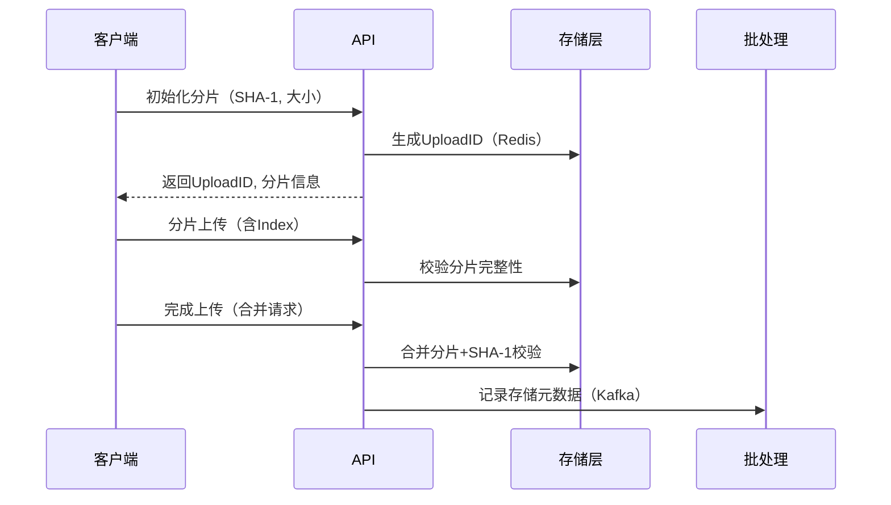
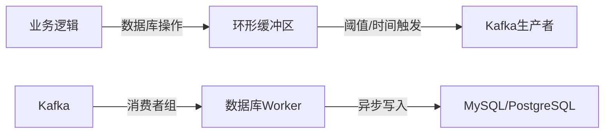

📦 PanPan Cloud - 微服务网盘系统

🚀 项目简介
PanPan Cloud 是一个支持多存储后端的分布式网盘系统，提供文件存储、秒传、分片上传 / 下载、异步任务处理等核心功能。支持本地磁盘、腾讯云 COS、Minio 集群三种存储方式，通过批处理队列（Kafka）实现数据库操作的异步化处理，保障高并发场景下的系统稳定性。

🌟 核心功能特性

🔥 文件存储（三模支持）
✅ 多存储后端：
* 本地磁盘（服务器文件系统）
* 腾讯云 COS（对象存储）
* Minio 集群（私有云对象存储）

✅ 上传能力：
* 🧩 分片上传（支持断点续传）
* ✨ 秒传（基于 SHA-1 指纹快速校验）
* 📏 自定义分片大小（开发环境 100MB，可调）

✅ 下载能力：
* ⚡ 分块并行下载（Goroutine 池并发控制）
* 🛡️ 文件完整性校验（SHA-1 哈希比对）
* 🚀 流式传输（零拷贝优化）

🔄 关键流程
1. 分片上传流程：

2. 批处理流程

🛠️ 技术栈

📥 安装与部署
> 依据docker-compose文件

📌 todo
1. 用户文件分享、连接分享
2. 文件删除、更改
3. 系统监控系统，微服务监控
4. 限速功能
5. 。。。

